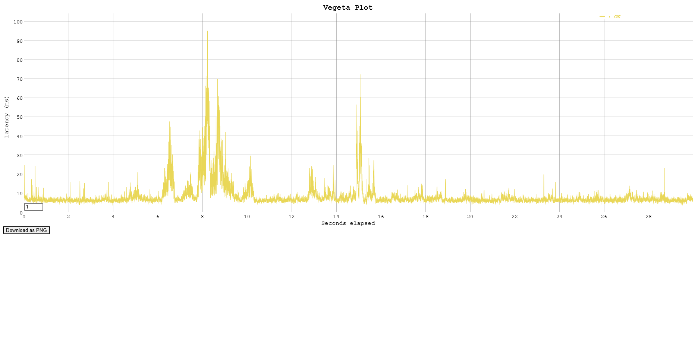

# Магазин мерча
Cервис предоставляет HTTP API для внутреннего магазина мерча, где сотрудники могут покупать товары за виртуальные монеты (coin), а также передавать монеты друг другу. Реализованы следующие функции:
- Покупка мерча
- Передача монет
- Просмотр истории

## Реализация

Микросервис разработан на Go. Для хранения информации используется реляционная СУБД - PostgreSQL. Сервис запускается в среде docker-compose, один контейнер для БД, другой для сервиса. Так же для интеграционных тестов можно поднять docker-compose с двумя контейнерами. 

В проекте не использовался веб-фреймворк. Для создания веб-сервера использовалась стандартная библиотека [net/http](). Для маршрутизации использовался роутер [httprouter](https://github.com/julienschmidt/httprouter), так как обладает всем нужным функционалом и работает намного быстрее аналогов.

В качестве драйвера для работы с PostgreSQL на Go был выбран [PQ](https://github.com/lib/pq), как надежный и хорошо зарекомендовавший себя драйвер PostgreSQL.

Также использовался пакет [jwt](https://github.com/pascaldekloe/jwt) для работы с jwt-токенами(кодирование/декодирование). Имеет простой и понятный синтаксис.

В качестве библиотеки для линтера был выбран [Golangci-lint](https://github.com/golangci/golangci-lint).

## Запуск

Есть Makefile со сценариями  unit_test, integration_test, build, stop.
1. Сценарий **unit_test** запуск всех юнит-тестов, также выводит процент покрытия (**43%)**
2. Сценарий **integration_test** поднимает докер контейнеры сервиса и БД, проводит интеграционные тесты и запускаются, после удаляет эти контейнеры.
3. Сценарий **build** зависит от unit_test и integration_test, поэтому сначала запустится они, потом запустится build.
4. Сценарий **stop** останавливает контейнеры.
   
Если нет **make**, то можно запустить командой:

 ``` docker compose up -d --build```

Интеграционные тесты корректно работают только в первый запуск, далее придется сбрасывать данные бд. Или по новой создавать контейнеры.

## Что не получилось

Не хватило времени реализовать интеграционные тесты для всех сценариев.

## Вопросы

1. Для запроса GET _/api/buy/{item}_ не совсем понятно какое значение передавать в параметр item. Было принято решение передавть имя мерча. Пример запроса: http://localhost:8080/api/buy/t-shirt

2. Что делать, если при покупке товара у пользователя недостаточно монет? Решил возвращать ошибку **402**(_Payment Required_) с сообщением "Недостаточно монет"


## Запросы

Запросы полностью соответсвуют спецификации в задании.
1. GET **_/api/info_** - Получить информацию о монетах, инвентаре и истории транзакций.
2. GET **_/api/buy/{item}_** - Купить предмет за монеты.
3. POST _**/api/sendCoin**_ - Отправить монеты другому пользователю.
4. POST _**/api/auth**_ - Аутентификация и получение JWT-токена. При первой аутентификации пользователь создается автоматически.

##  Планы на развитие
- Если список операций может расти весьма большим, то следует предусмотреть параметры limit/offset в запросах.
- Добавить кэширование.
- Расширенное логирование: сбор метрик, трейсинг запросов.
- Добавить swagger.

## Нагрузачное тестирование 
Нагрузочное тестирование выполнялось с помощью инструмента [vegeta](https://github.com/tsenart/vegeta).
Количество запросов в единицу времени - **1000/c**.
Продолжительность тестирования - **30с**.

